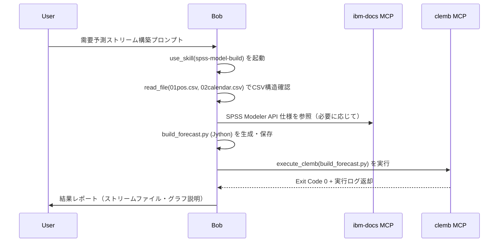

# IBM Bob × SPSS Modeler で需要予測ストリームのたたき台を作る

## はじめに

IBM Bob（IBM の AI コーディングアシスタント）を使って、SPSS Modeler の店舗別日次需要予測ストリームのたたき台を作ってみました。

SPSS Modeler は通常、ノードをGUIでキャンバスに配置・接続してストリームを組み上げていきます。SPSS Modeler には Jython スクリプトでこの GUI 操作をそのまま自動化できる機能があり、ノードの生成・接続・プロパティ設定をコードで表現できます。今回はこの仕組みを活用し、Bob にストリームのたたき台を生成させます。プロンプト1つから Jython スクリプト生成 → SPSS Modeler 実行 → ストリーム保存まで一気に進みます。もちろん複雑な処理はそのまま作れないこともありますが、**動くたたき台をすばやく手に入れる**という目的には十分使えます。その手順と仕組みをまとめます。

---

## 構成概要

Bob に拡張機能として **MCP** と **スキル** の3つを組み合わせて使います。

| コンポーネント              | 種別         | 役割                                                                                                                                                                 |
| --------------------------- | ------------ | -------------------------------------------------------------------------------------------------------------------------------------------------------------------- |
| **ibm-docs MCP**            | MCP サーバー | IBM 公式ドキュメントをリアルタイムで検索・参照。SPSS Modeler のノードプロパティや API 仕様を Bob に提供する                                                          |
| **spss-clemb MCP**          | MCP サーバー | SPSS Modeler の実行を Bob から直接呼び出せるようにする。Jython スクリプトをコマンドラインで実行し、ストリーム構築・保存をバッチ処理する                              |
| **spss-model-build スキル** | Bob スキル   | 「CSV からモデルを構築する」手順を定義したプロンプト定義ファイル。CSV 構造の把握 → モデル種別判定 → Jython スクリプト生成 → clemb 実行 の一連の流れを Bob に指示する。わからないことがあれば ibm-docs MCP でドキュメントを調べ、実行が失敗したらログを確認して修正・再実行するよう定義されている |

| 入力             | 内容                                                     |
| ---------------- | -------------------------------------------------------- |
| `01pos.csv`      | 販売実績（日付・店舗・商品・数量など）                   |
| `02calendar.csv` | カレンダーマスタ（祝日・販促・長期休暇・イベントフラグ） |

**出力例**（ファイル名や構成はプロンプト・データ内容によって変わります）

| 出力                 | 内容                     |
| -------------------- | ------------------------ |
| `store_forecast.str` | SPSS Modeler ストリーム  |
| `build_forecast.py`  | 生成元 Jython スクリプト |
| `build_forecast.log` | 実行ログ                 |

---

## 事前準備

### 1. MCP サーバーの登録

PowerShell でインストールスクリプトを実行するだけで登録できます。

**ibm-docs MCP**（IBM 公式ドキュメントを参照）
```powershell
# スクリプトをダウンロードして実行
irm https://raw.githubusercontent.com/hkwd/ibm-docs-mcp/main/install-ibm-docs-mcp.ps1 | iex
```

**spss-clemb MCP**（SPSS Modeler の `clemb.exe` を呼び出す）
```powershell
# スクリプトをダウンロードして実行
irm https://raw.githubusercontent.com/hkwd/spss-clemb-mcp/main/install-spss-clemb-mcp.ps1 | iex
```

インストール後、Bob の MCP 一覧で `ibm-docs` と `clemb` が有効になっていることを確認してください。

### 2. スキルの確認

`spss-model-build` スキルが Bob に登録されていることを確認します。このスキルには以下のようなストリームを作成する手順が定義されています。

- CSV 構造の把握手順
- モデル種別の自動判定ロジック
- Jython スクリプトの生成ルール（ノード配置・プロパティ設定）

---

## プロンプト

以下のプロンプトを Bob に投入します。

```
SPSS Modeler の店舗別日次需要予測ストリームを構築してください。

- 販売実績（01pos.csv）を取り込み、日付・店舗単位に売上数量を日次集計する
- カレンダーマスタ（02calendar.csv）を取り込み、日付キーで販売実績と突合・結合する
- 店舗ごとに、祝日・販促・長期休暇・イベントの4フラグもつかって、
  売上数量合計を時系列で予測するモデルをつくる
- 3日先まで予測する
- 2025年12月以降の予測期間データのみ抽出し、実績値と予測値を折れ線グラフで可視化する
```

---

## Bob の動作フロー



今回Bob が自律的に実行したステップは以下の通りです。

| #   | ツール          | 内容                                           |
| --- | --------------- | ---------------------------------------------- |
| 1   | `use_skill`     | `spss-model-build` スキルをロード              |
| 2   | `read_file`     | `01pos.csv` / `02calendar.csv` の構造を確認    |
| 3   | `write_file`    | `build_forecast.py`（Jython スクリプト）を生成 |
| 4   | `execute_clemb` | SPSS Modeler でスクリプトを実行                |
| 5   | 結果レポート    | ログ解析・ストリーム保存確認・グラフ説明       |

---

## 生成された Jython スクリプト

Bob が自動生成した [`build_forecast.py`](build_forecast.py) の要点を解説します。

### ストリームの全体構成

```
POS読み込み (variablefile)
  └─ 日次集計 (aggregate: SDATE×店舗 で 数量_Sum)
       └─ フィールドリネーム (filter: 数量_Sum → 売上数量)
            └─ カレンダー結合 (merge: SDATE キー)
                 ├─ カレンダー読み込み (variablefile)
                 └─ フィールド型定義 (type)
                      └─ 時系列予測 (ts: Expert Modeler + 店舗Split)
                           └─ [applyts nugget]
                                └─ 2025年12月以降 (select)
                                     └─ 店舗別需要予測グラフ (multiplot)
```

### 主要なコードポイント

**① 日次集計**

```python
agg_node = stream.createAt("aggregate", u"日次集計", 200, 100)
agg_node.setPropertyValue("keys", [u"SDATE", u"店舗"])
agg_node.setKeyedPropertyValue("aggregates", u"数量", [u"Sum"])
```

`SDATE`（販売日）× `店舗` をキーに数量を Sum 集計します。

**② カレンダー結合**

```python
merge_node.setPropertyValue("method",      u"Keys")
merge_node.setPropertyValue("key_fields",  [u"SDATE"])
merge_node.setPropertyValue("common_keys", True)
```

`SDATE` キーで内部結合し、4つのフラグ列を付加します。

**③ フィールドロール定義**

```python
type_node.setKeyedPropertyValue(u"direction", u"売上数量", u"Target")
type_node.setKeyedPropertyValue(u"direction", u"店舗",     u"Split")
for flag in [u"祝日フラグ", u"販促フラグ", u"長期休暇フラグ", u"イベントフラグ"]:
    type_node.setKeyedPropertyValue(u"direction", flag, u"Input")
    type_node.setKeyedPropertyValue(u"type",      flag, u"Flag")
```

- `売上数量` → Target（予測対象）
- `店舗` → Split（店舗ごとに別モデルを構築）
- フラグ4種 → Input（カレンダーイベントとして使用）

**④ Expert Modeler で時系列予測**

```python
ts_node.setPropertyValue("method",          "ExpertModeler")
ts_node.setPropertyValue("splitFields",     [u"店舗"])
ts_node.setPropertyValue("targets",         [u"売上数量"])
ts_node.setPropertyValue("events",          [u"祝日フラグ", u"販促フラグ",
                                              u"長期休暇フラグ", u"イベントフラグ"])
ts_node.setPropertyValue("forecastperiods", 3)
ts_node.setPropertyValue("extend_records_into_future", True)
```

Expert Modeler が ARIMA / 指数平滑などのモデルを店舗別に自動選択し、3日先まで予測します。フラグ4種をカレンダーイベントとして組み込むのがポイントです。

**⑤ グラフ出力**

```python
mp_node = stream.createAt("multiplot", u"店舗別需要予測グラフ", 1100, 170)
mp_node.setPropertyValue("panel_field", u"店舗")
mp_node.setPropertyValue("x_field",    u"SDATE")
mp_node.setPropertyValue("y_fields",   [u"売上数量", u"$TS-売上数量"])
```

`multiplot` で店舗別パネルを生成します。
- **青線** `売上数量`：実績値
- **橙線** `$TS-売上数量`：Expert Modeler による予測値

---

## 実行結果（今回のケース）

今回はエラーなく一発で通りました。ただしデータ構造やノード構成によっては失敗することもあります。その場合はスキルを育てて対処します（後述）。

```
Exit Code: 0 — 全工程 正常完了
```

| ステップ           | 内容                                                      | 結果             |
| ------------------ | --------------------------------------------------------- | ---------------- |
| ① POS 読み込み     | `01pos.csv` → `variablefile`                              | ✅                |
| ② 日次集計         | `SDATE` × `店舗` キーで `数量` を Sum                     | ✅ 1,462 レコード |
| ③ カレンダー結合   | `02calendar.csv` を SDATE キーで `merge`                  | ✅                |
| ④ フィールド型定義 | 売上数量=Target, 店舗=Split, フラグ×4=Flag                | ✅                |
| ⑤ 時系列予測       | Expert Modeler + 店舗別 Split + フラグ4個を events に指定 | ✅ 13秒           |
| ⑥ 期間フィルタ     | `SDATE >= "2025-12-01"` で抽出                            | ✅                |
| ⑦ グラフ出力       | `multiplot` で店舗別パネル（実績値 + 予測値）             | ✅                |
| ⑧ ストリーム保存   | `store_forecast.str` に保存                               | ✅                |

### 警告について

実行ログに `AEQTD0041W: metricFieldList のフィールドが重複` という警告が出ますが、これは `splitFields` 方式で複数店舗を分割予測する際に内部的にフラグが各スプリットへ重複列挙される**既知の挙動**です。モデル構築・予測結果には影響しません（エラーではなく警告）。

### ストリームの確認

`store_forecast.str` を SPSS Modeler で開くと、Bob が生成したストリームをそのまま確認・再実行できます。グラフはバッチモードでは画面表示されないため、Modeler 上で `店舗別需要予測グラフ` ノードを右クリック → 「実行」で確認してください。

---

## まとめ

| 項目             | 内容                                               |
| ---------------- | -------------------------------------------------- |
| **所要時間**     | プロンプト投入〜ストリーム完成まで **約4分**       |
| **人間の作業**   | プロンプト入力 + ツール承認クリックのみ            |
| **Bob の作業**   | CSV 構造確認 → Jython 生成 → clemb 実行 → 結果報告 |
| **生成コード量** | Jython 約140行                                     |

IBM Bob の MCP（ibm-docs / spss-clemb）とスキル（spss-model-build）を組み合わせると、**プロンプトだけでストリームのたたき台が手に入ります**。

もちろん、あらゆるストリームをそのまま作れるわけではありません。複雑なカスタム処理や特殊なノード構成では対応しきれないこともあります。ただ、**プロトタイプを素早く作って動作イメージを確認する**、あるいは**たたき台のストリームを生成して人手で仕上げる**といった用途には十分に役立ちます。予測日数の変更・集計粒度の変更なども、プロンプトを書き換えるだけで試せます。ぜひ活用してみてください。

### スキルの育て方

今回は特に問題が起きずに実行できましたが、スキルに定義されていないノードの処理や想定外のデータ構造が出てくると失敗することもあります。うまくいかないことがあった場合には、以下のようなプロンプトでスキルをアップデートしていくことができます。

```
今回のエラー内容と対処法を spss-model-build スキルに反映して
```

Bob がスキルファイル（`SKILL.md`）を直接編集し、次回以降の実行に活かせる形で知識を蓄積してくれます。失敗を繰り返すたびにスキルが賢くなっていく、**自己改善ループ**が実現できます。

---

## 参考リンク

- [IBM Bob ドキュメント](https://www.ibm.com/docs/ja/bob)
- [SPSS Modeler — 時系列モデルノード](https://www.ibm.com/docs/ja/spss-modeler)
- [ibm-docs MCP（GitHub）](https://github.com/IBM/ibm-docs-mcp) ※リンクは確認の上差し替えてください
- [spss-clemb MCP（GitHub）](https://github.com/IBM/spss-clemb-mcp) ※リンクは確認の上差し替えてください
